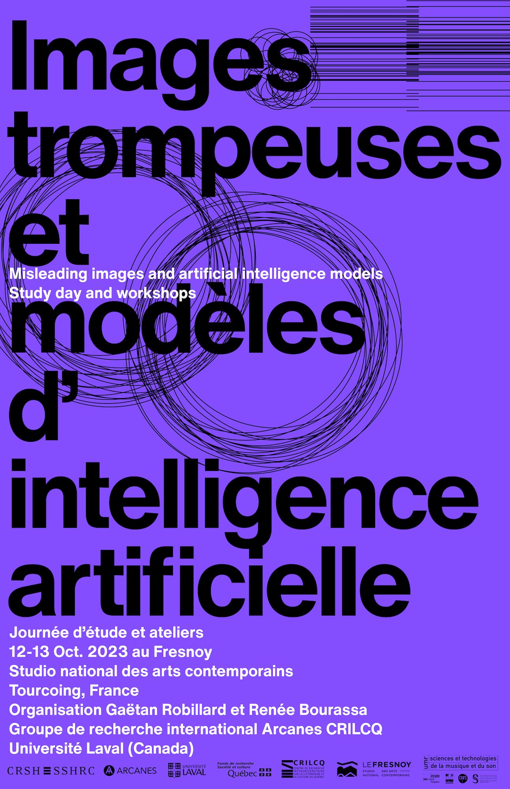

# Images trompeuses et modèles d'intelligence artificielle

Cycle journée d'étude et ateliers, les 12 et 13 octobre 2023 au Fresnoy, Studio national des arts contemporains

___Misleading Images and Artificial Intelligence Models___

_Study day and workshops, October 12 and 13 at Fresnoy, National studio of contemporary arts_

Voir programme (_see program_) [pdf](medias/programme.pdf)

## Résumés (_Abstracts_)

### Journée d'étude (_Study day_)

### Ateliers (_Workshops_)

## Biographies

## Ressources ateliers (_Workshops material_)

See mobilenet2gif repository for js code.
